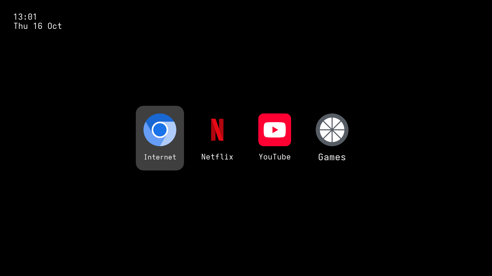

# couchpotato 🥔

`fedora-bootc` based image for home entertainment use, powered by [blue-build](https://github.com/blue-build/template). Operable with gamepads!



This is a work in progress. README is TBA.

## Installation

To rebase an existing atomic Fedora installation to the latest build:


```
# Deploy image and reboot
sudo bootc switch ghcr.io/askpng/fried-couchpotato:latest --apply 

# Deploy signed image and reboot
sudo bootc switch --enforce-container-sigpolicy ghcr.io/askpng/fried-couchpotato:latest --apply

# Update and reboot
sudo bootc upgrade --apply
```

The `latest` tag will automatically point to the latest build.

## ISO

TBA

## Verification

These images are signed with [Sigstore](https://www.sigstore.dev/)'s [cosign](https://github.com/sigstore/cosign). You can verify the signature by downloading the `cosign.pub` file from this repo and running the following command:

```bash
cosign verify --key cosign.pub ghcr.io/askpng/couchpotato
```
